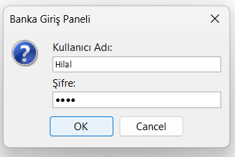
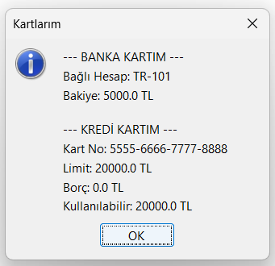
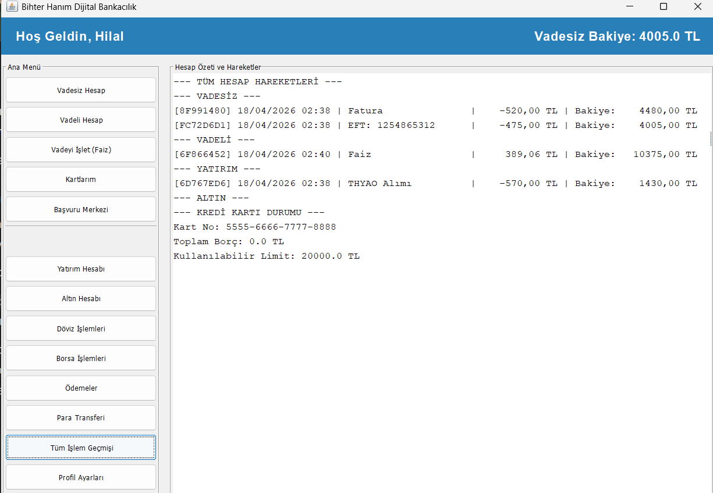

# Banking System (Java)

A comprehensive **Java-based digital banking simulation** that includes both **Console (CLI)** and **Swing GUI** implementations.
This project simulates real-world banking operations such as account management, money transfers, payments, investments, and financial services.

---

## Features

### Account Management

* Current Account (Checking)
* Fixed Deposit Account (Interest-based)
* Investment Account
* Gold Account (with real-time TL conversion)
* Create new accounts dynamically

### Money Transfers

* Internal transfer (Virman)
* External transfer (EFT / Havale)
* Secure balance validation with exception handling

### Card System

* Bank card linked to accounts
* Credit card system:

  * Limit control
  * Debt tracking
  * Transaction history

### Financial Operations

* Bill payments
* Donations
* Credit card debt payment

### Currency Exchange

* Buy/Sell USD and EUR
* Exchange rate calculation

### Stock Market Simulation

* Stock purchase operations (THYAO, ASELS, SISE)
* Integrated with investment account

### System Features

* Full transaction history
* Interest calculation for deposit accounts
* Custom exception handling system

### Graphical User Interface (Swing)

* User-friendly desktop interface
* Real-time balance updates
* Transaction list visualization
* Dialog-based interaction system

---

## Object-Oriented Programming Concepts

* Inheritance
* Polymorphism
* Encapsulation
* Abstraction
* Interface usage
* Custom exception handling

---

## ⚙️ Technologies

* Java
* Java Swing (GUI)
* OOP Principles
* Collections Framework
* Java Time API

---

## How to Run

### CLI Version

```bash
javac bankapp/BankApp.java
java bankapp.BankApp
```

### GUI Version

```bash
javac bankapp/BankaSwing.java
java bankapp.BankaSwing
```

---

## Default Login

```
Username: Hilal
Password: 1234
```

---

## 📁 Project Structure

```
bankapp/
 ├── BankApp.java
 ├── BankaSwing.java
 ├── Musteri.java
 ├── Hesap.java
 ├── Vadesiz.java
 ├── Vadeli.java
 ├── Yatirim.java
 ├── AltinHesabi.java
 ├── KrediKarti.java
 ├── Islem.java
```

---

---

## Screenshot




---

## Purpose of the Project

This project was developed to:

* Improve Object-Oriented Programming skills
* Simulate a real-world banking system
* Gain experience with Java Swing GUI development
* Practice exception handling and modular design
